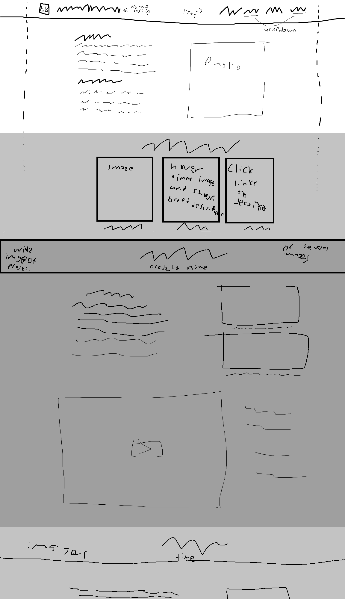

# Ideas brain dump
- Tagline idea: biohacking game developer
- Header nav bar: logo, name/tag, flrxible spaceing, About, Projects, Resume, Contact, links
- Dropdown nav items where appropriate
- Maybe use an unfocused screenshot of bankshot project as a background or maybe something similar to the dangerousthings.com background or maybe just a color probably dark
- Photo and about me first. Add a kind of skills section if room. 
- Next a gallery of projects with quick descriptions. Maybe images or gifs with descriptions on hover.
- Start sections for projects with a similar layout to that in inspiration.

# Inspirations
- Project section look and layout: https://www.chauhogamedesigner.com/

# Sources

## Images
-

## Fonts
-