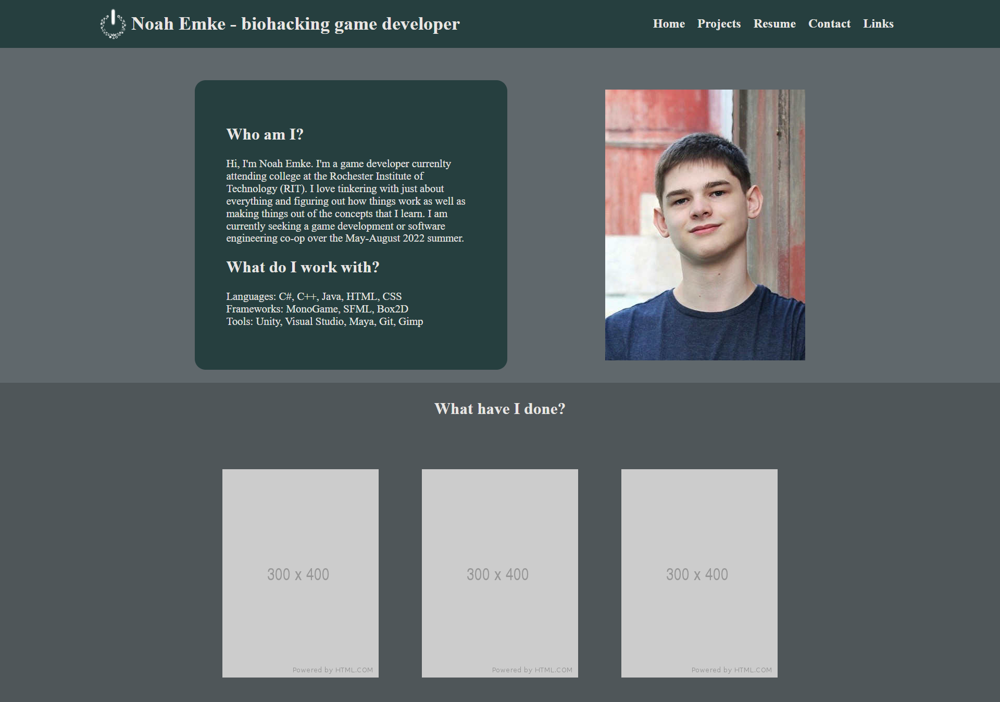

# Ideas brain dump
- Tagline idea: biohacking game developer
- Header nav bar: logo, name/tag, flexible spacing, About, Projects, Resume, Contact, links
- Dropdown nav items where appropriate
- Maybe use an unfocused screenshot of bankshot project as a background or maybe something similar to the dangerousthings.com background or maybe just a color probably dark
- Photo and about me first. Add a kind of skills section if room. 
- Next a gallery of projects with quick descriptions. Maybe images or gifs with descriptions on hover.
- Start sections for projects with a similar layout to that in inspiration.

# Inspirations
- Project section look and layout: https://www.chauhogamedesigner.com/
- General https://github.com/dccircuit/IGME-235-Fall-2021/blob/main/exercises/projects.md

# Sources

## Images
- https://brandeps.com/logo/C/C-Sharp-01
- https://commons.wikimedia.org/wiki/File:ISO_C%2B%2B_Logo.svg
- https://en.wikipedia.org/wiki/File:Java_programming_language_logo.svg
- https://icon-icons.com/icon/java-logo/168609
- https://commons.wikimedia.org/wiki/File:HTML5_logo_and_wordmark.svg
- https://commons.wikimedia.org/wiki/File:CSS3_logo_and_wordmark.svg
- https://commons.wikimedia.org/wiki/File:Unofficial_JavaScript_logo_2.svg
- https://commons.wikimedia.org/wiki/File:MonoGame_Logo.svg
- https://www.sfml-dev.org/download/goodies/
- https://commons.wikimedia.org/wiki/File:Box2D_logo.svg
- https://seeklogo.com/vector-logo/274050/unity
- https://commons.wikimedia.org/wiki/File:Visual_Studio_Icon_2019.svg
- https://worldvectorlogo.com/logo/maya-2017
- https://commons.wikimedia.org/wiki/File:Git-logo.svg
- https://commons.wikimedia.org/wiki/File:The_GIMP_icon_-_gnome.svg

## Fonts
- 

## Resources
- https://www.w3schools.com/howto/howto_css_dropdown_navbar.asp
- https://necolas.github.io/normalize.css/8.0.1/normalize.css
- https://codepen.io/mcraig218/pen/uqIae
- https://jsfiddle.net/e2d50fym/3/

# Prototypes and feedback

## Prototype 1
- [Last commit of prototype 1](https://github.com/MTFT-Games/personal-website/tree/6ee5ce7a1a529212bca6c6b5b8017311676555ec)

### Prototype feedback
- General positive response to progress so far.
- Projects might be a little small.
- Details on hover is cool.
- Unclear how room will be made for more projects.
- Proximity is used well.
- Colors (although not final) were well received.
- Text contrasts well against dark background.
- Suggested to change projects background to a similar hue to the header.
- Alignment was inconsistent but not necessarily bad.
- Suggested to align future project sections like about section.
- Navigation is simple and straightforward.
- Dropdowns were liked but need a background. Suggested to use the same blur and dim as the gallery.
- Currently not responsive at all.
- Code is neat and readable.
- Suggested that the tag line shouldn't be in your header, it doesn't fit well and doesn't belong with the current design.
- Others liked the tagline in the header.
- Need fonts other than the default. something blocky maybe.
- Reduce nav bar padding (3vw seems better)
- Add more space between name and logo
- Use a background instead of solid color. Big triangle of vibrant color left of about to mid of header as an idea. Add other random shapes to fill space.
- On that note, keep the background asymmetric. 
- Darken the background of gallery, navy blue maybe. 
- Square off about me. 
- Maybe have dark faded symbol behind about me. 
- Try to design with non linear background but boxy words and pics. 
- Essentially make background varying but text and such sharp and boxy.