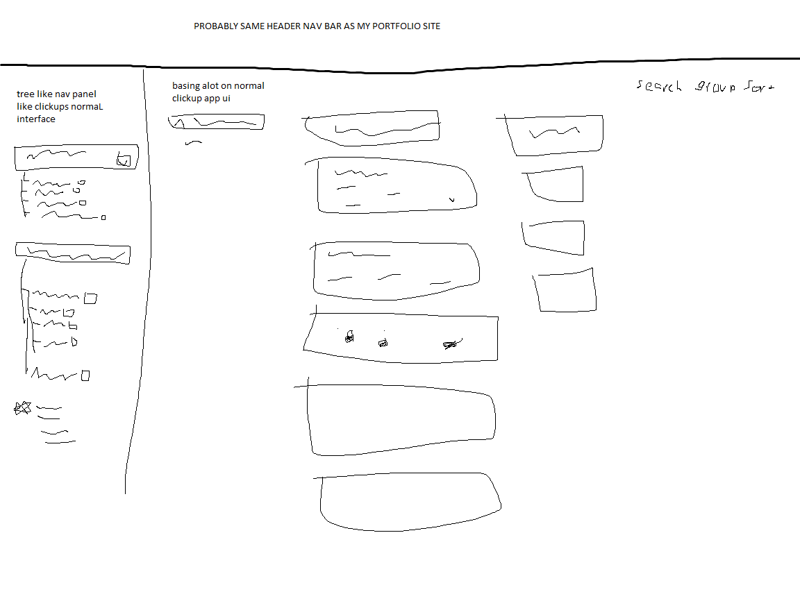

# Requierments
- Functional
  - Uses the ClickUp API
  - Stores view settings and last loaded tasks source in local storage
  - For controls it has: 
    - The entire expandable hierarchy on the left with buttons on each workspace, space, folder, and list to expand them or shoe the tasks in that section
    - The sort setting
    - The group setting
    - The subtask setting
  - No javascript errors are thrown by the app to my knowledge unless you count when I make a custom popup for something going wrong that doesnt throw an exception.
- design and interaction
  - i think decent interface inspired by the clickup app
  - does not resemble GIPHY
  - controls are labeled 
  - instructions are provided on first use.
  - errors are handled with a custom popup message
  - the state of the app is shown with a loading gif whenever the app is loading or waiting on an api request
  - It should be usable at various sizes but the responsiveness needs improvement
  - html and css is valid and images are almost all svg
  - all js is external using only let and const and queryselector
  - dry is mostly followed although some improvements could likely be made
  - All functions have JSDoc comments and inline comments within. i think i did pretty good on the comments.

I think this is A- or B+. Especially when it is noted that i went above and beyond and set up a cors-anywhere proxy on my own server as well as just the amount of javascript that went into this app. I dont have much of a reference but 1000+ lines of javascript seems like a lot...

# Pitch
- What are you planning to create?  Include purpose, audience, and main functionality.
  - A window into my to-do lists. Friends can see how busy I am before dragging me into a game or parents can see how I'm keeping up with things, others can for any other reason see what I'm currently working on and what I have to do, potential employers might look into the progress or plans for work in progress projects.
- What API(s) are you planning to use?  If it's not one of the pre-selected APIs, include a link to the documentation for it.
If you are hoping to use a "choose your own" API, you must also include a link to a page on banjo where results from the API are visible on a web page - no formatting necessary.
  - API: Clickup
    - What is that?: A project/task management app https://clickup.com/
  - Documentation: https://clickup.com/api
  - Test on banjo: https://people.rit.edu/nre5152/235/project2/test.html
  - Can I access it?: yes see above
  - Does it support CORS?: kinda no but i set up a proxy with a cors-anywhere nodejs server running on my server and configured the apache server hosting my website to send requests through to it when appropriate. it was kinda easy, I thought you said that would be a pain in the vid.
    - TLDR: No but i fixed it so it works anyway.
  - Does it require Oauth?: No, it can use a personal token or Oauth. 
  - Does it have a free tier?: Yes, free ClickUp accounts get 100 requests per minute which I think is plenty for this usage.

# Inspirations
- Clickup

# Sources

## Images
- https://commons.wikimedia.org/wiki/File:Hamburger_icon.svg
- https://seekicon.com/free-icon/keyboard-arrow-down_2
- https://commons.wikimedia.org/wiki/File:Ic_arrow_drop_down_36px.svg
- https://www.reddit.com/r/loadingicon/comments/eerigj/it_all_makes_sense_now_oc/
- https://commons.wikimedia.org/wiki/Category:Colored_flag_icons
- https://loading.io/css/

## References
- w3schools.com
- class tutorials
- api docs